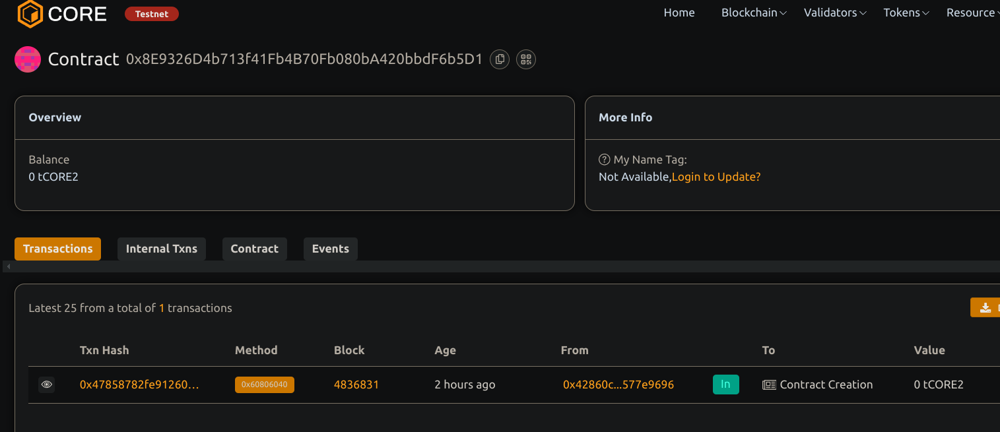

# Decentralized Job Board with Escrow Payments

## Project Description
A decentralized job board smart contract where employers can post jobs with escrowed payments, workers can accept jobs, mark  them completed get paid securely once the employer's releases funds.

## Project Vision
To create a trustless and transparent platform connecting employers and workers, ensuring fair payments with escrow,clear job  management on blockchain.

## Key Features  
- Employers can post and fund jobs with escrow payments.
- Workers can accept and complete jobs. 
- Employers release payment after job  completion.
- Ability to cancel unfunded or incomplete jobs with refunds.  
- Transparent job status within its tracking on-chain. 

## Future Scope
- Separated projects features and future scope
- Adding dispute resolution mechanisms. 
- Integration with reputation and rating system
- Support for milestone payments. 
- Frontend UI for job browsing and management
- ERC20 token payments support.

## Contract details of this contract 
0x8E9326D4b713f41Fb4B70Fb080bA420bbdF6b5D1

